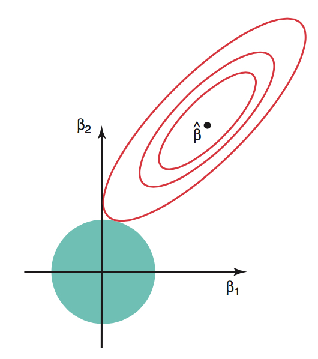

```{r setup}
#| include: false

library(countdown)

knitr::opts_chunk$set(
  fig.width = 8,
  fig.asp = 0.618,
  fig.retina = 3,
  dpi = 300,
  out.width = "80%",
  fig.align = "center"
)

options(scipen=999)
```

## Announcements

-   HW 03 due TODAY at 11:59pm

-   Project exploratory data analysis due TODAY at 11:59pm (on GitHub)

-   Project presentations - in lab March 27

-   Statistics experience due April 2

**Submit questions by 5pm today. Form at the end of today's notes.**

# AE 05

## Topics

-   Ridge regression

## Computing set up

```{r}
#| echo: true
#| message: false

# load packages
library(tidyverse)  
library(tidymodels)  
library(knitr)       
library(patchwork)
library(rms)

# set default theme in ggplot2
ggplot2::theme_set(ggplot2::theme_bw())
```

## Data: Age of abalones

The data for this analysis contains measurements for abalones, a type of marine snail. These measurements were collected and analyzed by researchers in Warwick et al. ([1994](https://sta221-sp26.github.io/hw/hw-03.html#ref-warwick1994population)). [Click here](https://www.researchgate.net/profile/Warwick-Nash/publication/287546509_7he_Population_Biology_of_Abalone_Haliotis_species_in_Tasmania_I_Blacklip_Abalone_H_rubra_from_the_North_Coast_and_Islands_of_Bass_Strait/links/5d949460458515202b7bf592/7he-Population-Biology-of-Abalone-Haliotis-species-in-Tasmania-I-Blacklip-Abalone-H-rubra-from-the-North-Coast-and-Islands-of-Bass-Strait.pdf) for the publication.

The 4177 abalones in this study can be reasonably treated as a random sample.

**The goal of this analysis is to use characteristics of the abalones to predict their age.**

```{r}
#| echo: false
abalones <- read_csv("data/abalone.csv")
```

## Variables

-   `Sex`: Male (M), Female (F), Infant (I)
-   `Length`: Longest shell measurement (in millimeters)
-   `Diameter`: Measured perpendicular to length (in millimeters)
-   `Height` : Measured with meat in shell (in millimeters)
-   `Whole_Weight`: Total weight of abalone (in grams)
-   `Age`: Age (in years)

## Fit a model {.midi}

```{r}
age_fit <- lm(Age ~ Sex + Length + Diameter + Height
              + Whole_Weight, data = abalones)

tidy(age_fit) |> kable(digits = 3)
```

## Potential issue

```{r}
vif(age_fit)
```

<br>

::: question
-   What is the potential issue with this model?

-   How does this impact the model results?
:::

## Limitations of the least-squares estimator

-   When $(\mathbf{X}^\mathsf{T}\mathbf{X})$ is nearly singular, $Var(\hat{\boldsymbol{\beta}})$ gets large, and thus we have unstable coefficient estimates . This occurs when

    -   There are collinear predictors
    -   $p$ is large relative to $n$

-   Additionally, if $p > n$ , then we cannot find $\hat{\boldsymbol{\beta}}$

-   We can use a different estimator that addresses these limitations

## Finding the ridge estimator {.midi}

We find the ridge estimator, $\hat{\boldsymbol{\beta}}_{ridge}$ by minimizing

$$
\underbrace{(\mathbf{y} - \mathbf{X}\boldsymbol{\beta})^\mathsf{T}(\mathbf{y} - \mathbf{X}\boldsymbol{\beta})}_{\text{SSR}} + \underbrace{\lambda \boldsymbol{\beta}^\mathsf{T}\boldsymbol{\beta}}_{\text{penalty}}
$$

where $\lambda \geq 0$ is the *tuning parameter* determined by the statistician (more on this later)

. . .

-   Like least-squares, ridge regression seeks to minimize the sum of squares

-   The penalty, $\lambda\boldsymbol{\beta}^\mathsf{T}\boldsymbol{\beta} = \lambda\sum_{j = 1}^p\beta^2_j$ preferences smaller values of $\beta_j$, so ridge will shrink the coefficients to 0 (this does not apply to the intercept)

## Finding the ridge estimator

We find the ridge estimator, $\hat{\boldsymbol{\beta}}_{ridge}$ by minimizing

$$
\underbrace{(\mathbf{y} - \mathbf{X}\boldsymbol{\beta})^\mathsf{T}(\mathbf{y} - \mathbf{X}\boldsymbol{\beta})}_{\text{SSR}} + \underbrace{\lambda \boldsymbol{\beta}^\mathsf{T}\boldsymbol{\beta}}_{\text{penalty}}
$$

<br>

::: question
What will happen to $\hat{\boldsymbol{\beta}}_{ridge}$ as $\lambda \rightarrow 0$? What will happen as$\lambda \rightarrow \infty$ ?
:::

## Finding the ridge estimator {.midi}

The ridge optimization problem can also be written

$$\text{minimize }(\mathbf{y} - \mathbf{X}\boldsymbol{\beta})^\mathsf{T}(\mathbf{y} - \mathbf{X}\boldsymbol{\beta}) \hspace{2mm} \text{subject to} \hspace{2mm} ||\boldsymbol{\beta}||^2_2 \leq c^2$$ for some constant $c$ . Note: $||\boldsymbol{\beta}||_2 = \sqrt{\sum_{j=1}^p\beta_j^2}$

. . .

:::::: columns
::: {.column width="50%"}
{fig-align="center" width="55%"}
:::

:::: {.column width="50%"}
-   Red contours are combinations of $\beta_1$ and $\beta_2$ that result in same SSR

-   Blue circle is set of possible values of $\beta_1$ and $\beta_2$ given the constraint

-   Ridge solution at tangent

::: small
See Section 1.5 of [Lecture notes on ridge regression](https://arxiv.org/pdf/1509.09169) for details.
:::
::::
::::::

## Ridge estimator $\hat{\boldsymbol{\beta}}_{ridge}$

The ridge estimator is

$$
\hat{\boldsymbol{\beta}}_{ridge} = (\mathbf{X}^\mathsf{T}\mathbf{X} + \lambda\mathbf{I})^{-1}\mathbf{X}^\mathsf{T}\mathbf{y}
$$

(see Exam 01 for derivation)

-   We have addressed the singularity of $(\mathbf{X}^\mathsf{T}\mathbf{X})$ by adding the positive constant to the diagonal

::: question
-   What is $E(\hat{\boldsymbol{\beta}}_{ridge})$?

-   Is $\hat{\boldsymbol{\beta}}_{ridge}$ unbiased?
:::

## Bias-variance trade-off

-   The penalty $\lambda\boldsymbol{\beta}^\mathsf{T}\boldsymbol{\beta}$ makes the estimated coefficients in ridge regression less variable than least-squares

-   Therefore, by adding some bias, we are able to reduce variance. This is called the **bias-variance trade-off** <!--# add refrence to theorem here-->

-   Reducing the variance in coefficients is particularly important when we wish to use a model for prediction on new data

<br>

::: small
See Section 1.4.2 of [Lecture notes on ridge regression](https://arxiv.org/pdf/1509.09169) for details.
:::

## Fitting the model {.midi}

::: incremental
-   We use **standardized values** of the predictors when fitting the ridge regression model

-   Why do we use standardized values? Let's consider `Length` (in millimeters) in the `abalone` data

    -   Let $\beta_j$ be the coefficient of `Length`. When finding the ridge estimates, the penalty for the coefficient of `Length` is $\lambda \beta_j^2$ .

    -   Suppose instead of `Length` in millimeters, we use `Length` in meters. Then the new coefficient is $1000\beta_j$. Thus, the penalty on the term would be $\lambda 1000^2\beta_j^2$

-   Standardizing the quantitative predictors ensures the penalty is fairly applied across all predictors (and not dependent on units)

-   Thus, shrinkage in the $\beta_j$ reflects the predictor's importance on the response
:::

## Ridge regression in R

Fit ridge regression models using `lm.ridge()` in the **MASS** package.

```{r}
lambda <- 5

ridge_fit <- MASS::lm.ridge(Age ~ Sex + Length + Diameter +
                              Height + Whole_Weight,
                            data = abalones,
                            lambda = lambda)
```

::: callout-tip
**MASS** a `select()` function that will cause issues with `select()` in **dplyr**. Therefore, use the `package::function()` syntax instead of loading **MASS.**
:::

## Ridge regression in R {.small}

```{r}
#| code-fold: true
tidy(ridge_fit) |> kable(digits = 3)
```

. . .

-   **lambda**: tuning parameter
-   **GCV:** Generalized cross validation
-   **estimate:** ridge coefficient given $\lambda$
-   **scale**: standard deviation of $x_j$ (used by R to compute standardized predictors)

```{r}
#| echo: false

# short cut to scale all numeric variables except the response
abalone_scaled <- abalones |>
  mutate(across(where(is.numeric) & ! all_of("Age"), scale))
```

## Try different values of lambda

```{r}
#| code-fold: true
lambdas <- seq(0, 1000, length = 5000)
ridge_fit <- MASS::lm.ridge(Age ~ Sex + Length + Diameter + Height + Whole_Weight, 
                            data = abalones, lambda = lambdas)

# Plot ridge trace
plot(ridge_fit, main = "Ridge Trace Plot")

coef_names <- colnames(coef(ridge_fit))
coef_names <- coef_names[coef_names != "(Intercept)"]

n <- length(coef_names)
colors <- palette()[1:n]          

legend(
  x = "topright",
  legend = coef_names,
  col    = colors,
  lty    = 1:n,              
  lwd    = 2,
  title  = "Coefficients",
  bty    = "n",
  cex    = 0.8
)

```

::: question
What is happening to the coefficients as $\lambda$ increases?
:::

## GCV to choose $\lambda$

-   We'll choose $\lambda$ by considering how well the model predicts on new data

-   Leave one out cross validation (LOOCV) is a method for evaluating model performance on new data, such that one observation is held out as the new data

-   Generalized cross validation (GCV) is a an approximation of LOOCV where we do not have to compute the model $n$ times for each $\lambda$

-   We use the $\lambda$ with the minimum value of GCV

## GCV to choose $\lambda$ {.midi}

-   The fitted values from ridge regression can be written as

    $$
    \hat{\mathbf{y}} = \mathbf{H}_\lambda\mathbf{y}
    $$

where $\mathbf{H}_\lambda$ is the hat matrix for a given value of $\lambda$ .

-   The average LOOCV for a given $\lambda$ is

$$
CV(\lambda) = \frac{1}{n}\sum_{i=1}^{n}\Big(\frac{y_i - \hat{y}_i}{1 - h_{ii}}\Big)^2
$$

where $h_{ii}$ is the $i^{th}$ diagonal element of $\mathbf{H}_\lambda$.

## GCV to choose $\lambda$

-   GCV uses the $\bar{h}_{ii} = tr(\mathbf{H}_\lambda)/n$ instead of the individual $h_{ii}$

    $$
    GCV (\lambda) = \frac{1}{n}\sum_{i=1}^{n}\frac{(y_i - \hat{y}_i)^2}{\big(1 - \frac{tr(\mathbf{H}_\lambda)}{n}\big)^2}
    $$

-   We use the `select()` function in **MASS** to find $\lambda$ that minimizes GCV

    ```{r}
    MASS::select(ridge_fit)
    ```

## Refit model with selected $\lambda$  {.midi}

```{r}
lambda <- 1.40028

ridge_fit_2 <- MASS::lm.ridge(Age ~ Sex + Length + Diameter +
                              Height + Whole_Weight,
                            data = abalones,
                            lambda = lambda)
```

```{r}
#| echo: false

tidy(ridge_fit_2) |> kable(digits = 3)
```

## Further reading

-   Ridge regression is a form of "penalized regression" and is often called "regularization" or a "shrinkage method". Other such methods are LASSO and best subset selection.

-   One (potential) limitation of ridge regression is that it keeps all predictors in the models. Methods such as LASSO and best subset selection address this.

-   Resources for further reading:

    -   Early ridge paper: [Hoerl and Kennard 1970](https://www.jstor.org/stable/1271436?seq=6)

    -   [Lecture notes on ridge regression](https://arxiv.org/pdf/1509.09169) by Wessel N. van Wieringen

## Questions

```{=html}
<center>
<iframe width="640px" height="480px" src="https://forms.office.com/r/h4BdM85Bjf?embed=true" frameborder="0" marginwidth="0" marginheight="0" style="border: none; max-width:100%; max-height:100vh" allowfullscreen webkitallowfullscreen mozallowfullscreen msallowfullscreen> </iframe>
</center>
```

🔗 <https://forms.office.com/r/h4BdM85Bjf>

## Next class

-   Logistic regression

-   Complete [Lecture 18 prepare](../prepare/prepare-lec18.html)
