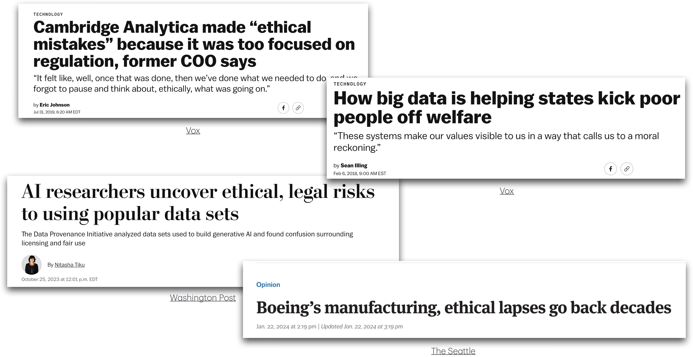
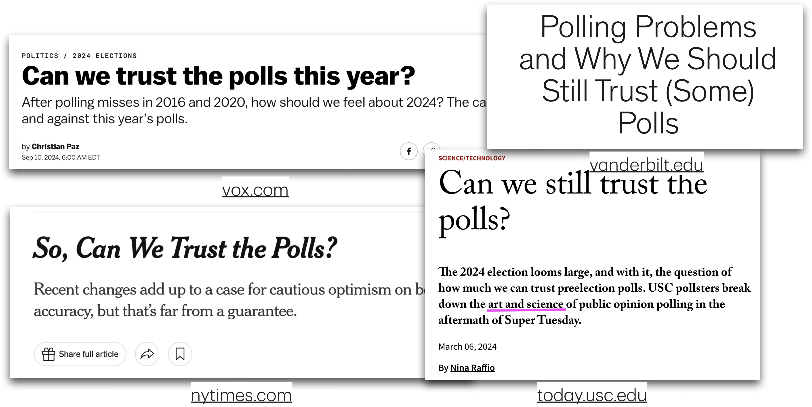
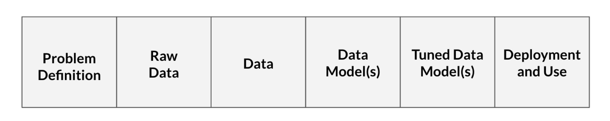

```{r setup, include=FALSE, echo=FALSE}
options(htmltools.dir.version = FALSE)
knitr::opts_chunk$set(
	fig.align = "center",
	fig.height =5,
	fig.width = 8,
	message = FALSE,
	warning = FALSE
)
```

## Announcements

-   HW 04 due Thursday, April 9 at 11:59pm

-   Next project milestone: Draft report due Friday, April 10 (before lab)

-   Exam 02

    -   In-class: April 14

    -   Take-home: April 14 - 16

    -   Content: February 19 (Model conditions & diagnostics) - Today (Data science ethics)

## Topics

-   Confidence interval for an individual coefficient
-   Data science ethics

## Computational setup

```{r}
#| echo: true
#| warning: false
#| message: false


library(tidyverse)
library(tidymodels)
library(pROC)      
library(knitr)
library(kableExtra)

# set default theme in ggplot2
ggplot2::theme_set(ggplot2::theme_bw())
```

## Risk of coronary heart disease {.midi}

This data set is from an ongoing cardiovascular study on residents of the town of Framingham, Massachusetts. We want to examine the relationship between various health characteristics and the risk of having heart disease.

-   `high_risk`:

    -   1: High risk of having heart disease in next 10 years
    -   0: Not high risk of having heart disease in next 10 years

-   `age`: Age at exam time (in years)

-   `totChol`: Total cholesterol (in mg/dL)

-   `currentSmoker`: 0 = nonsmoker, 1 = smoker

-   `education`: 1 = Some High School, 2 = High School or GED, 3 = Some College or Vocational School, 4 = College

```{r}
#| echo: false
#| message: false
#| warning: false


heart_disease <- read_csv("data/framingham.csv") |>
  select(age, education, TenYearCHD, totChol, currentSmoker) |>
  drop_na() |>
  mutate(
    high_risk = as_factor(TenYearCHD),
    education = as_factor(education),
    currentSmoker = as_factor(currentSmoker)
  )
```

## Test for a single coefficient

**Hypotheses:** $H_0: \beta_j = 0 \hspace{2mm} \text{ vs } \hspace{2mm} H_a: \beta_j \neq 0$, given the other variables in the model

. . .

**(Wald) Test Statistic:** $$z = \frac{\hat{\beta}_j - 0}{SE(\hat{\beta}_j)}$$

where $SE(\hat{\beta}_j)$ is the square root of the $j^{th}$ diagonal element of $Var(\hat{\boldsymbol{\beta}})$

. . .

**P-value:** $P(|Z| > |z|)$, where $Z \sim N(0, 1)$, the Standard Normal distribution

## Coefficient for `age` {.midi}

```{r}
#| label: risk-model-age-highlight
#| echo: false

heart_disease_fit <- glm(high_risk ~ age + totChol + currentSmoker, 
              data = heart_disease, family = "binomial")

tidy(heart_disease_fit, conf.int = TRUE) |> 
  kable(digits = 3) |>
  row_spec(2, background = "#D9E3E4")
```

. . .

**Hypotheses:**

$$
H_0: \beta_{age} = 0 \hspace{2mm} \text{ vs } \hspace{2mm} H_a: \beta_{age} \neq 0
$$, given total cholesterol and smoking status are in the model.

## Coefficient for `age` {.midi}

```{r}
#| echo: false
#| ref.label: risk-model-age-highlight
```

**Test statistic:**

$$z = \frac{ 0.0825  - 0}{0.00575} = 14.34
$$

## Coefficient for `age` {.midi}

```{r}
#| echo: false
#| ref.label: risk-model-age-highlight
```

**P-value:**

$$P(|Z| > |14.34|) \approx 0
$$

. . .

```{r}
2 * pnorm(14.34,lower.tail = FALSE)
```

## Coefficient for `age` {.midi}

```{r}
#| echo: false
#| ref.label: risk-model-age-highlight
```

**Conclusion:**

The p-value is very small, so we reject $H_0$. The data provide sufficient evidence that age is a statistically significant predictor of whether someone is high risk of having heart disease, after accounting for total cholesterol and smoking status.

## Confidence interval for $\beta_j$

We can calculate the **C% confidence interval** for $\beta_j$ as the following:

$$
\Large{\hat{\beta}_j \pm z^* \times SE(\hat{\beta}_j)}
$$

where $z^*$ is calculated from the $N(0,1)$ distribution

. . .

This is an interval for the change in the log-odds for every one unit increase in $x_j$

## Interpretation in terms of the odds

The change in **odds** for every one unit increase in $x_j$.

$$
\Large{\exp\{\hat{\beta}_j \pm z^* \times SE(\hat{\beta}_j)\}}
$$

. . .

**Interpretation:** We are $C\%$ confident that for every one unit increase in $x_j$, the odds multiply by a factor of $\exp\{\hat{\beta}_j - z^* \times SE(\hat{\beta}_j)\}$ to $\exp\{\hat{\beta}_j + z^* \times SE(\hat{\beta}_j)\}$, holding all else constant.

## CI for `age`

```{r}
#| echo: false
#| ref.label: risk-model-age-highlight
```

::: question
Interpret the 95% confidence interval for `age` in terms of the **odds** of being high risk for heart disease.
:::

## Overview of testing coefficients

**Test a single coefficient**

-   Drop-in-deviance test

-   Wald hypothesis test and confidence interval

. . .

**Test a subset of coefficients**

-   Drop-in-deviance test

. . .

Can use AIC and BIC to compare models in both scenarios

# Data science ethics

## When things go wrong



## Gap in public trust



------------------------------------------------------------------------

<br>

<br>

<br>

"…coverage of polls \[data science\] often **does not adequately convey the many decisions** that pollsters \[data scientists\] must make … as well as the **potential consequences of those decisions**”

::: aside
Clinton, J. (2021, January 11). Polling problems and why we should still trust (some) polls. The Vanderbilt Project on Unity and American Democracy. <https://www.vanderbilt.edu/unity/2021/01/11/polling-problems-and-why-we-should-still-trust-some-polls/>
:::

------------------------------------------------------------------------

## "Ideal objectivity?"

::: incremental
-   **Desire for “ideal objectivity”**

    -   Work that is free from interference of human perception [@feinberg2023myth]

    -   Conclusions that are observer independent [@gelman2017beyond]

-   **Feels like the ethical approach** [@feinberg2023myth]

-   **There are implications** [@feinberg2023myth]

    -   Distorted reality of data analysis process

    -   Lack of communication about decisions that don’t seem “objective”
:::

## The role of data science ethics

-   Illuminates the the decision-making in data science

    -   Makes explicit the existence of choice throughout an analysis

    -   Makes explicit the moral implications of our choices

-   Align data science practices with what we ought to do and moral duties to stakeholders

::: aside
Source: @colando2024philosophy
:::

## Processes in data science {.midi}

{fig-align="center"}

-   **Problem definition**: Question we wish to answer with data
    -   What is the likelihood a customer purchases product S?
    -   Our model (built on training data) is successful if it achieves at least 75% accuracy on testing data

::: aside
Source: @colando2024philosophy
:::

## Processes in data science {.midi}

{alt="Source: Figure 1 of @colando2024philosophy" fig-align="center"}

-   **Raw data**: Information collected by interacting with the world
    -   Information from each time the customer clicks on an advertisement for product S
    -   Includes timestamps for each advertisement interaction and the customer’s demographic information

::: aside
Source: @colando2024philosophy
:::

## Processes in data science {.midi}

{alt="Source: Figure 1 of @colando2024philosophy" fig-align="center"}

-   **Data**: Processed form of raw data
    -   Data table where each row represents a unique customer and the columns are the variables that describe that customer
    -   Includes information from raw data and engineered variables (e.g., average time between clicks)
    -   We decide what to do with missing data

::: aside
Source: @colando2024philosophy
:::

## Processes in data science {.midi}

{alt="Source: Figure 1 of @colando2024philosophy" fig-align="center"}

-   **Data model(s)**: Product from running input data through learning algorithm (generalize the relationship between variables in the data)
    -   We choose a logistic regression model of the form

$$
\log(\frac{\pi}{1-\pi}) = \beta_0 + \beta_1 ~ \text{age} 
+ \beta_2 ~ \text{number clicks}
 + \beta_3 ~ \text{avg time between clicks}
$$

::: aside
Source: @colando2024philosophy
:::

## Processes in data science {.midi}

{alt="Source: Figure 1 of @colando2024philosophy" fig-align="center"}

-   **Tuned data model(s)**: Data model in which the parameters are adjusted
    -   Use 5-fold cross validation to determine which variables to include in order to improve model's accuracy

::: aside
Source: @colando2024philosophy
:::

## Processes in data science {.midi}

{alt="Source: Figure 1 of @colando2024philosophy" fig-align="center"}

-   **Deployment and usage**: Generating predictions (or other output) from the tuned model
    -   Determine that the model should only be used for customers under a certain age
    -   Determine only data scientists at the company selling product S should be able to access model and sell products from it

::: aside
Source: @colando2024philosophy
:::

## Your data science process {.midi}

{width="90%"}

::: question
What are some decisions you have made (or will make) in your project or other data analysis work?
:::

## What is data science ethics?

Data science ethics studies and evaluates moral problems related to:

-   **Data:** generation, recording, process, dissemination, and sharing

-   **Algorithms:** artificial intelligence, machine learning, large language models, and statistical learning models

-   **Corresponding practices:** responsible innovation, programming, hacking, professional code

::: aside
Sources: @colando2024philosophy, @floridi2016data
:::

## Data science ethics issues

::::: columns
::: {.column width="50%"}
-   Bias, fairness, and justice

-   Causation

-   Data privacy and informed consent

-   Explainability, interpretability, and transparency

-   Responsibility
:::

::: {.column width="50%"}
-   Applications in government and policing

-   Professional ethics

-   Reproducibility

-   ..and more
:::
:::::

::: aside
List adapted from @colando_data_science_ethics and @baumer2017modern
:::

## Data Science Oath {.midi}

1.  I will not be ashamed to say, “I know not,” nor will I fail to call in my colleagues when the skills of another are needed for solving a problem.

2.  I will respect the privacy of my data subjects, for their data are not disclosed to me that the world may know, so I will tread with care in matters of privacy and security.

3.  I will remember that my data are not just numbers without meaning or context, but represent real people and situations, and that my work may lead to unintended societal consequences, such as inequality, poverty, and disparities due to algorithmic bias.

<small>From @nas2018data_science_undergraduate_project based on the Hippocratic Oath for physicians.</small>

## Responsibility {.midi}

The data scientist is (morally) responsible for

-   How the data are handled and stored
-   Modeling decisions
-   Implications of data handling and modeling
-   Providing clear documentation and guidance on model use

. . .

The user is (morally) responsible for

-   Understanding the model and its limitations
-   How the model is deployed

::: aside
Source: @colando2024philosophy
:::

## Example: Mistaken identity {.midi}

Angela Lipps, from Tennessee, spent 5 months in jail after facial recognition software connected her to a string of bank fraud cases in Fargo, North Dakota

-   Police were investigating a string of cases in Fargo, ND in which a woman used a fake ID to withdraw money from a bank account or home-equity line of credit
-   Investigators used facial recognition technology to identify a potential suspect based on bank surveillance video
-   The software "identified a potential suspect with similar features to Angela Lipps"

::: aside
Source: [New York Times](https://www.nytimes.com/2026/03/30/us/north-dakota-facial-recognition-ai-errors-bank-fraud.html)
:::

## Example: Mistaken identity {.midi}

-   Police used Angela Lipps' Facebook and Instagram accounts, along with her Tennessee ID to determine she matched the identified suspect
-   She was released from jail after a judge dismissed the case

::: aside
Source: [New York Times](https://www.nytimes.com/2026/03/30/us/north-dakota-facial-recognition-ai-errors-bank-fraud.html)
:::

## Example: Mistaken identity {.midi}

-   Facial recognition company, Clearview AI uses "publicly available images" for its data base and to train its models used by law enforcement agencies

-   Their statement on how models should be used:

    > "Once a search is performed, the search may return a set of potential leads, which the investigator is required to independently verify by both peer review and other means, before continuing with their investigation."

-   Website reports "99% accuracy for all demographics"

::: aside
Source: <https://www.clearview.ai/>
:::

## Example: Mistaken identity

::: question
-   What are the ethical considerations and responsibilities for the data scientists [building]{.underline} such facial recognition technology?
:::

<br>

::: question
-   What are the ethical considerations and responsibilities for those [using]{.underline} such facial recognition technology?
:::

## Example case study

A data analyst received permission to analyze a data set that was scraped from a social media site. The full data set included name, screen name, email address, geographic location, IP (internet protocol) address, demographic profiles, and preferences for relationships.

<br>

::: question
What are ethical considerations of putting a deidentified data set with name and email address removed in a LLM (e.g., Claude or ChatGPT) to help with analysis?
:::

::: aside
Adapted from Chapter 8 of @baumer2017modern
:::

## Further reading

-   [American Statistical Association: Ethical Guidelines for Statistical Practice](https://www.amstat.org/your-career/ethical-guidelines-for-statistical-practice)

-   [Data science ethics reading lists](https://scolando.github.io/data-science-ethics/Reading-Tags.html)

-   [Chapter 8 in Modern Data Science with R](https://mdsr-book.github.io/mdsr3e/08-ethics.html#sec-ethics-intro)

## Further reading

-   When things go wrong examples:

    -   [Cambridge Analytica made 'ethical mistakes' because it was too focused on regulation, former COO says](https://www.vox.com/recode/2019/7/31/20747874/cambridge-analytica-julian-wheatland-great-hack-netflix-documentary-kara-swisher-podcast-interview) from Vox.com

    -   [How big data is helping states kick poor people off welfare](https://www.vox.com/2018/2/6/16874782/welfare-big-data-technology-poverty) from Vox.com

    -   [How AI researchers uncover ethical, legal risks to using popular data sets](https://www.washingtonpost.com/technology/2023/10/25/data-provenance/) from the Washington Post

    -   [Boeing's manufacturing, ethical lapses go back decades](https://www.seattletimes.com/opinion/boeings-manufacturing-ethical-lapses-go-back-decades/) from the Seattle Times

## Further reading

-   Gap in public trust examples

    -   [Can we trust the polls this year?](https://www.vox.com/2024-elections/370649/trust-polls-2016-2020-election-2024-pollster-polling-miss) from Vox.com

    -   [Polling problems and why we should still trust (some) polls](https://www.vanderbilt.edu/unity/2021/01/11/polling-problems-and-why-we-should-still-trust-some-polls/) from Vanderbilt Project on Unity and American Democracy

    -   [So, can we trust the polls?](https://www.nytimes.com/2024/11/01/upshot/so-can-we-trust-the-polls.html) from New York Times

    -   [Can we still trust the polls?](https://today.usc.edu/can-we-still-trust-the-polls/) from University of Southern California

## Recap

-   Confidence interval for an individual coefficient

-   Data science ethics

## Next class

-   Exam 02 review

-   No prepare assignment

## References
